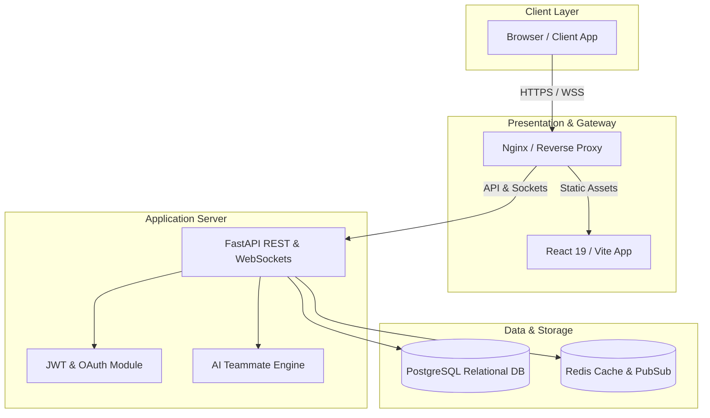

<p align="center">
  
</p>

<h1 align="center">DevLink</h1>

<p align="center">
  <strong>Build With People Who Actually Ship.</strong>
</p>

<p align="center">
  An enterprise-grade open-source developer collaboration platform designed to connect builders, founders, designers, AI engineers, and open-source contributors to form teams, track issues, and launch production-ready applications.
</p>

<p align="center">
  <a href="https://github.com/nensii21/devlink/blob/main/LICENSE"></a>
  <a href="https://github.com/nensii21/devlink/stargazers"></a>
  <a href="https://github.com/nensii21/devlink/network/members"></a>
  <a href="https://github.com/nensii21/devlink/issues"></a>
  <a href="https://github.com/nensii21/devlink/pulls"></a>
  <a href="https://github.com/nensii21/devlink/graphs/contributors"></a>
</p>

---

## 📌 Quick Links

- 📖 **[API Documentation](docs/api.md)** | **[Interactive Swagger UI](http://localhost:8000/docs)**
- 🏗️ **[Architecture Overview](docs/architecture.md)**
- 🚀 **[Development Guide](docs/development.md)**
- 🐳 **[Docker Compose Setup](#-docker--quick-start)**
- 🤝 **[Contribution Guidelines](CONTRIBUTING.md)**

---

## 🎬 Demo & Product Showcase

<p align="center">
  
  <br>
  <em>Figure 1: DevLink Teammate Discovery & Real-Time Project Dashboard.</em>
</p>

---

## 📸 Interface Screenshots

| Developer Discovery & Profiles | Project Marketplace & Applications |
| :---: | :---: |
|  |  |
| *Filter builders by skills, availability & GitHub score* | *Post collaboration requests & review applicant profiles* |

| Real-Time Messaging & Workspace | AI Compatibility Recommendations |
| :---: | :---: |
|  |  |
| *Instant messaging via WebSockets with typing status* | *AI-driven teammate and project matching engine* |

---

## 🌟 Key Platform Features

- **⚡ Teammate Matchmaking**: AI-assisted skill matching connecting front-end, back-end, AI/ML, and DevOps builders.
- **📁 Project Marketplace**: Discover open requests, apply with portfolio credentials, and manage team roles.
- **💬 Real-Time WebSockets**: Instant Direct Messaging (DM), notification broadcasts, typing indicators, and online status.
- **📊 Repository Quality Metrics**: Automated score evaluation of linked GitHub repos based on coverage, docs, and activity.
- **🔒 Enterprise Security**: OAuth 2.0 (GitHub), JWT access/refresh token rotation, rate limiting, and security headers.

---

## 🏛 System Architecture

DevLink follows a decoupled, cloud-native architecture. The front-end communicates with an asynchronous FastAPI application server, PostgreSQL database, and Redis cache/broker.



*For complete diagrams and architectural deep-dives, see **[Architecture Documentation](docs/architecture.md)**.*

---

## 💻 Tech Stack

| Domain | Technologies |
| :--- | :--- |
| **Frontend** | React 19, TypeScript, Tailwind CSS v4, TanStack Query/Router, Framer Motion |
| **Backend** | Python 3.11+, FastAPI, Pydantic v2, SQLAlchemy 2.0, Asyncpg |
| **Realtime** | WebSockets, Redis Pub/Sub |
| **Database & Caching** | PostgreSQL 15+, Redis 7+ |
| **AI Integration** | OpenAI API, Model Context Protocol (MCP) |
| **DevOps & Containers** | Docker, Docker Compose, DevContainers, GitHub Actions |

---

## 🚀 Docker & Quick Start

### 1. Launch Everything via Docker Compose (Recommended)

Launch Backend, Frontend, PostgreSQL, and Redis with a single command:

```bash
docker-compose -f docker-compose.dev.yml up --build
```

- **Frontend Application**: `http://localhost:5173`
- **Backend REST API**: `http://localhost:8000/api`
- **Interactive Swagger Docs**: `http://localhost:8000/docs`

---

### 2. Manual Local Setup

#### Backend Setup
```bash
cd backend
python -m venv venv
source venv/bin/activate  # On Windows: venv\Scripts\activate
pip install -r requirements.txt
uvicorn app.main:app --reload
```

#### Frontend Setup
```bash
cd frontend
npm install
npm run dev
```

---

## 📚 API Documentation

DevLink exposes a comprehensive RESTful API. Below is a quick overview of primary routes:

| Route Group | Base Endpoint | Description |
| :--- | :--- | :--- |
| **Authentication** | `/api/auth` | Login, Register, JWT Refresh, GitHub OAuth |
| **User Profiles** | `/api/users` | Developer profile CRUD, bio export, search |
| **Projects** | `/api/projects` | Project postings, tech stack tagging, bookmarks |
| **Applications** | `/api/applications` | Team application submission & status management |
| **Messaging** | `/api/messages` | Direct messaging & thread history |
| **Recommendations**| `/api/recommendations`| AI teammate & project matching |

*For complete endpoint request/response payloads, see **[docs/api.md](docs/api.md)**.*

---

## 🗺 Product Roadmap

- [x] **Phase 1: Core Platform**: Developer profiles, project creation, JWT auth, and repository links.
- [x] **Phase 2: Real-time Communication**: WebSocket messaging, application tracking, and global search.
- [x] **Phase 3: AI Engine & Intelligence**: Teammate matching algorithms, auto bio summaries, and repo scoring.
- [ ] **Phase 4: Ecosystem & Expansion**: Mobile app (React Native), organization teams, and browser extensions.

---

## ❓ Frequently Asked Questions (FAQ)

<details>
<summary><strong>Is DevLink free and open source?</strong></summary>
<p>Yes! DevLink is licensed under the MIT License and completely open source. Anyone can contribute or host their own instance.</p>
</details>

<details>
<summary><strong>How does the AI Teammate Recommendation work?</strong></summary>
<p>Our recommendation engine evaluates tech stack overlap, availability, past projects, and profile embeddings to suggest optimal collaborators.</p>
</details>

<details>
<summary><strong>Can I run DevLink inside VS Code / GitHub Codespaces?</strong></summary>
<p>Yes! We provide a pre-configured DevContainer setup in <code>.devcontainer/</code> with preinstalled tools, linting, and port forwarding.</p>
</details>

---

## 🤝 Contribution Flow

We welcome contributions from developers of all experience levels!

1. **Fork the Repository** on GitHub.
2. **Create a Feature Branch**: `git checkout -b feat/your-feature-name`
3. **Commit Your Changes**: Follow Conventional Commits (e.g. `feat(auth): add OAuth provider`).
4. **Push & Create Pull Request**: Open a PR pointing to `main`.

*Please read **[CONTRIBUTING.md](CONTRIBUTING.md)** for detailed coding standards and pull request criteria.*

---

## 📄 License & Maintainers

Distributed under the **MIT License**. See `LICENSE` for details.

* **Lead Maintainer**: Nensi Patel ([@nensii21](https://github.com/nensii21))
* **Community**: ECSoc 2026 Open Source Contributors
