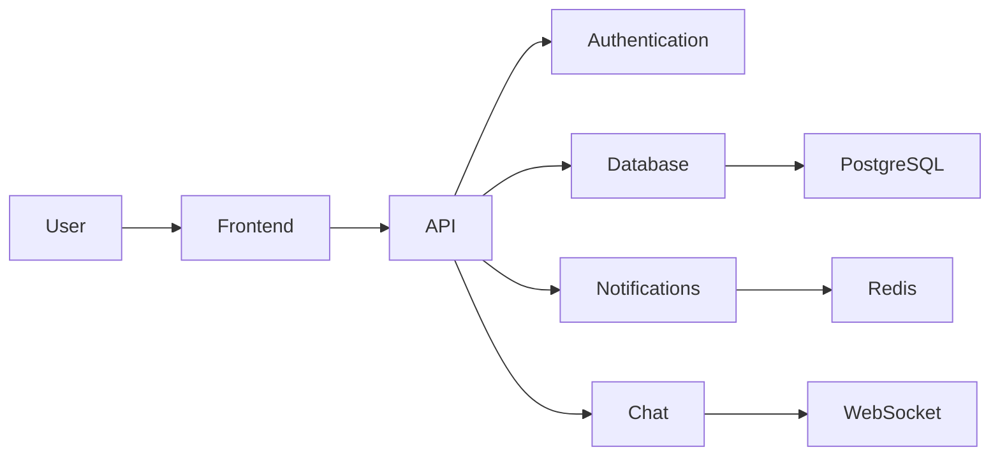

<p align="center">
  
</p>

<h1 align="center">DevLink</h1>

<p align="center">
  <strong>Build. Collaborate. Launch.</strong><br>
  The modern open-source platform where developers, founders, designers, and contributors build products together.
</p>

<p align="center">
  <a href="LICENSE">
    
  </a>
  <a href="#">
    
  </a>
  <a href="#">
    
  </a>
  <a href="#">
    
  </a>
  <a href="#">
    
  </a>
</p>

---

# Overview

DevLink is an open-source social platform designed for developers, startup founders, designers, AI engineers, and contributors to discover projects, collaborate with teams, and build products together.

Instead of managing GitHub repositories, LinkedIn networking, Discord communities, and hackathon groups separately, DevLink brings everything into one unified platform.

Whether you're searching for contributors, showcasing projects, joining startups, or participating in hackathons, DevLink provides a streamlined experience focused on collaboration.

---

# Screenshots

## Dashboard

<p align="center">

</p>

---

## Authentication

<p align="center">

</p>

---

## Project Page

<p align="center">

</p>

---

## Feed

<p align="center">

</p>

---

## Mobile Experience

<p align="center">

</p>

---

# Features

### Developer Profiles

- Professional portfolio
- Skills
- Experience
- GitHub integration
- Project showcase
- Social links

---

### Project Collaboration

- Create projects
- Find contributors
- Join teams
- Track progress
- Manage applications

---

### Social Feed

- Share updates
- Publish achievements
- Community discussions
- Follow developers
- Like & comment

---

### Real-time Messaging

- One-to-one chat
- Team conversations
- Notifications
- Instant communication

---

### Authentication

- Email authentication
- OAuth
- Secure sessions
- JWT authentication

---

### Discover

- Search developers
- Search projects
- Trending repositories
- Recommended collaborators

---

### Notifications

- Project invitations
- Messages
- Collaboration requests
- Activity updates

---

### Responsive Design

- Desktop
- Tablet
- Mobile
- Dark mode support

---

# Tech Stack

## Frontend

- React
- TypeScript
- Tailwind CSS
- React Router
- React Query

## Backend

- FastAPI
- SQLAlchemy
- PostgreSQL
- Redis
- JWT

## DevOps

- Docker
- GitHub Actions
- Nginx

---

# Architecture



---

# Repository Structure

```
DevLink/

├── backend/
│   ├── app/
│   ├── api/
│   ├── models/
│   ├── services/
│   └── core/
│
├── frontend/
│   ├── src/
│   ├── components/
│   ├── pages/
│   ├── hooks/
│   └── assets/
│
├── docs/
│
├── assets/
│   └── screenshots/
│
├── docker/
│
└── .github/
```

---

# Quick Start

## Clone Repository

```bash
git clone https://github.com/YOUR_USERNAME/DevLink.git

cd DevLink
```

---

## Backend

```bash
cd backend

python -m venv venv

source venv/bin/activate

pip install -r requirements.txt

uvicorn app.main:app --reload
```

---

## Frontend

```bash
cd frontend

npm install

npm run dev
```

---

# Environment Variables

Backend

```
DATABASE_URL=

JWT_SECRET=

JWT_ALGORITHM=

ACCESS_TOKEN_EXPIRE_MINUTES=

REDIS_URL=
```

Frontend

```
VITE_API_URL=
```

---

# Running with Docker

```bash
docker compose up --build
```

---

# Project Roadmap

## Phase 1

- User authentication
- Developer profiles
- Projects
- Applications
- Messaging

---

## Phase 2

- GitHub integration
- Team workspaces
- AI recommendations
- Hackathons
- Notifications

---

## Phase 3

- Organizations
- Payments
- Recruiter Portal
- Analytics
- Mobile App

---

# Testing

Backend

```bash
pytest
```

Frontend

```bash
npm run test
```

Lint

```bash
npm run lint
```

---

# Contributing

1. Fork the repository

2. Create a feature branch

```bash
git checkout -b feature/amazing-feature
```

3. Commit changes

```bash
git commit -m "feat: add amazing feature"
```

4. Push

```bash
git push origin feature/amazing-feature
```

5. Open a Pull Request

---

# Good First Issues

Contributors can work on:

- UI improvements
- Accessibility
- Documentation
- API enhancements
- Performance optimization
- Bug fixes
- Testing
- Responsive design

---

# Documentation

```
docs/

Architecture

API

Deployment

Contributing

Design System
```

---

# Security

Please report security vulnerabilities responsibly.

Never expose secrets or API keys in commits.

---

# License

Distributed under the MIT License.

---

# Contributors

<a href="https://github.com/YOUR_USERNAME/DevLink/graphs/contributors">

</a>

---

# Star History

[](https://star-history.com)

---

<p align="center">

Built with ❤️ by the DevLink Community

</p>
