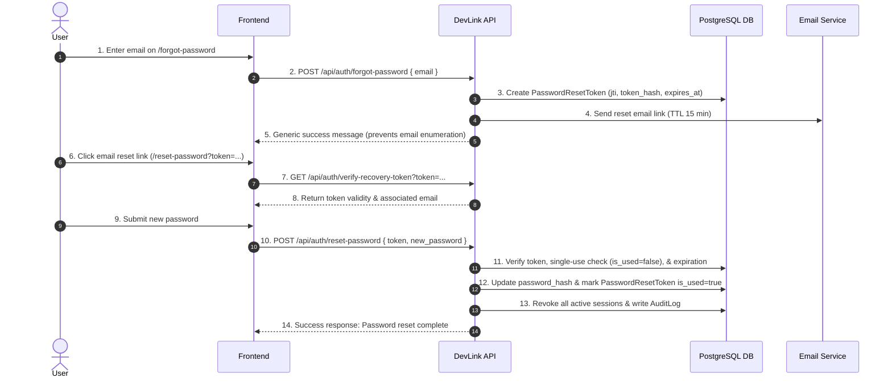

# Secure Account Recovery Flow Documentation (#587)

DevLink **Secure Account Recovery Flow** provides end-to-end password reset and recovery capabilities for users who lose access to their accounts. The architecture enforces single-use recovery tokens, strict 15-minute expiration window, email enumeration prevention, automatic session revocation upon password reset, rate limiting, and security audit logging.

---

## 1. Recovery Flow Overview



---

## 2. Security Safeguards

- **Single-Use Enforcement**: Every token contains a unique `jti` stored in the `password_reset_tokens` table. Once a password is reset, `is_used` is set to `true`, and subsequent attempts with the same token are rejected (`400 Bad Request`).
- **Short-Lived TTL**: Recovery tokens automatically expire after **15 minutes**.
- **Anti-Enumeration**: `/forgot-password` returns a uniform success response regardless of whether the email address exists in the system.
- **Active Session Revocation**: When a password reset completes successfully, all existing refresh tokens/active user sessions are automatically revoked via `RefreshTokenService.revoke_all_tokens`.
- **Password Policy & History**: New passwords must satisfy strict complexity requirements and cannot match any of the user's last 5 passwords.
- **Rate Limiting**: `/forgot-password` and `/reset-password` endpoints are rate limited under `AUTH_LIMIT`.
- **Audit Logs**: All recovery requests and completions write audit records (`AuditAction.PASSWORD_RESET_REQUESTED` and `AuditAction.PASSWORD_RESET_COMPLETED`).

---

## 3. API Reference

### 1. Request Recovery Email
`POST /api/auth/forgot-password`

**Request Body:**
```json
{
  "email": "user@example.com"
}
```

**Response:**
```json
{
  "success": true,
  "message": "If an account associated with this email exists, a password reset link has been sent."
}
```

---

### 2. Verify Recovery Token (Pre-check)
`GET /api/auth/verify-recovery-token?token={token_string}`

**Response:**
```json
{
  "valid": true,
  "message": "Recovery token is valid.",
  "email": "user@example.com"
}
```

---

### 3. Reset Password
`POST /api/auth/reset-password`

**Request Body:**
```json
{
  "token": "eyJhbGciOiJIUzI1Ni...",
  "new_password": "NewSecurePassword123!"
}
```

**Response:**
```json
{
  "success": true,
  "message": "Password has been successfully reset. You can now log in with your new password."
}
```

---

## 4. Running Tests

Execute backend unit and integration tests:
```bash
cd backend
./venv/bin/pytest tests/test_secure_account_recovery.py -v
```

Expected output: **6 passed**.
